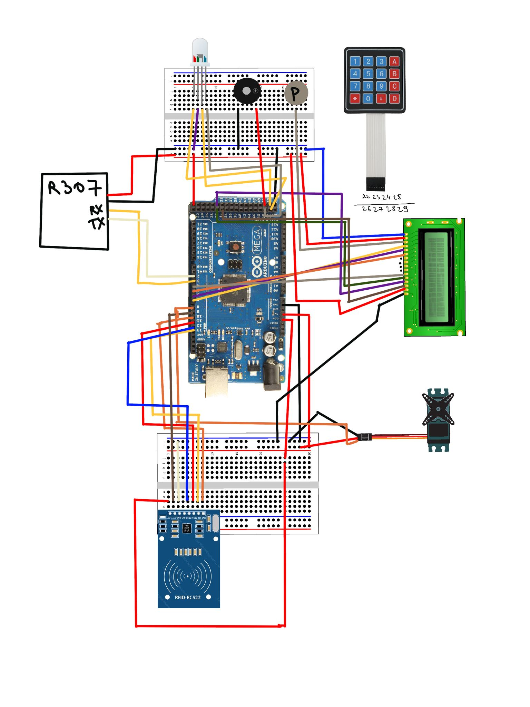

# RFEX - Machine Learning Based Door Lock 
This GitHub repository contains the code and documentation for a Machine Learning based door lock system that leverages advanced authentication methods. The primary authentication method is face recognition, and as an alternative, it offers a combination of fingerprint and passcode authentication.

## Key Features
- Face Recognition: The system utilizes face recognition as the primary method for user authentication. It uses an ESP32 CAM module for efficient face recognition.

- Fingerprint and Passcode Backup: In case face recognition fails or as an alternative authentication method, the system supports fingerprint and passcode authentication. It incorporates an R307 fingerprint sensor for fingerprint recognition and a keypad for passcode input.

- Enrollment Algorithm: The repository includes an enrollment algorithm designed to enroll new users into the device securely. This ensures that only authorized individuals can access the protected area.

- Authentication Algorithm: The core of the system is the authentication algorithm, which functions as a door lock. It grants access based on successful authentication through face recognition, fingerprint, or passcode.

- Hardware Components:

    - Arduino Mega: The Arduino Mega serves as the main controller for the device, coordinating the various hardware components.
    - ESP32 CAM: This module is responsible for capturing and processing facial images for recognition.
    - R307 Fingerprint Sensor: It reads fingerprints to provide an additional layer of security.
    - Keypad: A standard Chinese keypad is used for passcode input.
    - LEDs and Buzzer: LEDs and a buzzer are employed to indicate whether the door is open or locked.
    - Liquid Crystal Screen: An LCD screen displays information and instructions for users.

## Hardware Configuration

Note that the provided connection include an RFID reader but we did not use it in the final version of the device; instead, it incorporates a camera as part of the ESP32 CAM module to facilitate face recognition.

## Contribution Guidelines
We welcome contributions from the open-source community.

## License
This project is licensed under the MIT License. See the LICENSE file for details.

## Acknowledgments
We would like to express our gratitude to the open-source community for their contributions and support in making this project possible, to the project Supevisor Prof. Parvaneh Esmaili and contributers Milena Turatbikova, Ravilya Rafikova and Yusa Capraz 

